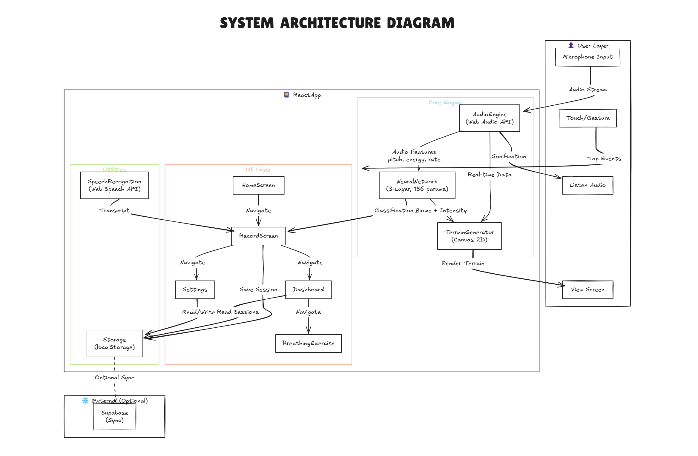

# 🎙️ Resonance

**Your best buddy** — a vocal journal app built with React that lets you record, analyse and revisit your thoughts through voice.

## ✨ Features
Core

✅ One-tap recording — Big pulsing mic button, intuitive flow
✅ Real-time terrain — Canvas updates live as you speak
✅ On-device AI — 156-parameter neural network, zero latency
✅ 5 unique biomes — Each with distinct color palette and terrain signature
✅ Speech transcription — Temporary on-device via Web Speech API
✅ Contextual analysis — 2-3 line insight into emotional triggers

Wellness

✅ Pattern detection — "3 stormy days → suggest breathing exercise"
✅ Breathing exercises — 4 animated patterns (Box, 4-7-8, Energizing, Cooling)
✅ Streak tracking — Daily consistency encouragement
✅ Weekly dashboard — Trend graphs + terrain gallery

Privacy & Accessibility

✅ 100% on-device — No audio leaves your device
✅ No account required — Works offline with localStorage
✅ Language agnostic — Prosody analysis works in any language
✅ No literacy required — Visual + audio feedback only
✅ Sonification ready — Audio feedback for terrain changes
✅ Export data — JSON export for personal records

## 🛠️ Tech Stack

Frontend          React 18 + Tailwind CSS
Audio Processing  Web Audio API + Custom DSP
AI/ML             Vanilla JS 3-Layer Neural Network (on-device)
Visualization     HTML5 Canvas 2D + Procedural fBm Noise
Charts            Recharts
Storage           localStorage (primary) + Supabase (optional sync)
Icons             Lucide React
Animation         Framer Motion



## 🚀 Getting Started

### Prerequisites

- [Node.js](https://nodejs.org/) (v18 or higher recommended)
- npm (comes with Node.js)

### Installation

```bash
# Clone the repository
git clone https://github.com/Kusum0710/Resonance.git
cd Resonance

# Install dependencies
npm install
```

### Development

```bash
# Start the dev server
npm run dev
```

The app will be available at `http://localhost:5173` (default Vite port).

### Build for Production

```bash
# Create an optimized production build
npm run build

# Preview the production build locally
npm run preview
```

### Linting

```bash
npm run lint
```

## 📁 Project Structure

```
Resonance/
├── public/               # Static assets
├── src/
│   ├── assets/           # Images & media
│   ├── components/
│   │   └── VoiceRecorder.jsx   # Core voice recording component
│   ├── App.jsx           # Main app component
│   ├── App.css           # App styles
│   ├── index.css         # Global styles
│   └── main.jsx          # Entry point
├── index.html            # HTML template
├── package.json
└── vite.config.js
```

## 🤝 Contributing

1. Fork the repository
2. Create your feature branch (`git checkout -b feature/amazing-feature`)
3. Commit your changes (`git commit -m 'Add some amazing feature'`)
4. Push to the branch (`git push origin feature/amazing-feature`)
5. Open a Pull Request

## 📄 License

This project is open source and available under the [MIT License](LICENSE).
